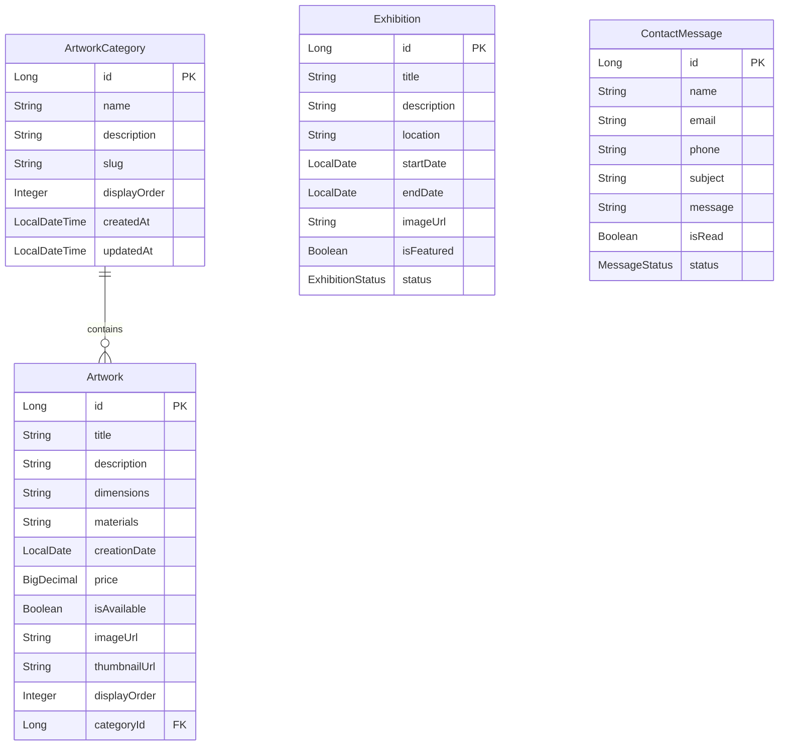

# PGF Artist Website - Backend API

## 📋 Vue d'ensemble du projet

Site web portfolio pour l'artiste PGF, composé d'un backend Spring Boot RESTful et d'un frontend Angular v20. Le site présente les œuvres de l'artiste organisées par catégories, son historique d'expositions, sa biographie et permet aux visiteurs de le contacter.

## 🏗️ Architecture du site web

### Structure des pages (Frontend Angular v20)

```
PGF Artist Website
├── À propos
│   ├── L'artiste (biographie + portrait)
│   ├── Les expositions (prochaine + historique chronologique)
│   └── Association PGF
├── Œuvres
│   ├── Fils de fer
│   ├── Toile de Jute  
│   ├── Peinture
│   ├── Sculptures
│   └── Écritures (page lifestyle avec sections image/texte)
├── Contact (formulaire de contact)
└── Footer minimaliste
```

### Correspondances Backend/Frontend

| Page Frontend | Entité Backend | API Endpoints |
|---------------|----------------|---------------|
| À propos → Expositions | `Exhibition` | `/api/exhibitions/*` |
| Œuvres → Catégories | `ArtworkCategory` + `Artwork` | `/api/categories/*`, `/api/artworks/*` |
| Contact | `ContactMessage` | `/api/contact/*` |

## 🚀 Technologies

### Backend
- **Java 21** - Version LTS moderne
- **Spring Boot 3.3.2** - Framework principal
- **PostgreSQL 15** - Base de données
- **Flyway** - Migrations de schéma
- **MapStruct 1.5.5** - Mapping DTO/Entity
- **Lombok** - Réduction du boilerplate
- **SpringDoc OpenAPI** - Documentation API
- **Docker** - Containerisation

### Frontend (spécifications)
- **Angular v20** - Framework frontend
- **TypeScript** - Langage principal
- **Responsive Design** - Compatible mobile/desktop

## 🗄️ Modèle de données

### Entités principales



### Catégories d'œuvres prédéfinies
1. **Fils de fer** - Œuvres réalisées avec des fils de fer
2. **Toile de Jute** - Créations sur toile de jute
3. **Peinture** - Tableaux et peintures
4. **Sculpture** - Sculptures et installations
5. **Écriture** - Textes et œuvres littéraires

## 🔧 Configuration et installation

### Prérequis
- Java 21 (OpenJDK)
- Maven 3.8+
- PostgreSQL 15
- Docker & Docker Compose (optionnel)
- IntelliJ IDEA Ultimate (recommandé)

### Variables d'environnement
```bash
# Configuration base de données
export PGF_DB_URL="jdbc:postgresql://localhost:5432/pgf_db"
export PGF_DB_USERNAME="pgf_user" 
export PGF_DB_PASSWORD="rescue"
```

### Installation locale

1. **Cloner le projet**
```bash
git clone <repo-url>
cd pgf-backend
```

2. **Configuration base de données**
```sql
-- Créer la base de données
CREATE DATABASE pgf_db;
CREATE USER pgf_user WITH ENCRYPTED PASSWORD 'rescue';
GRANT ALL PRIVILEGES ON DATABASE pgf_db TO pgf_user;
```

3. **Lancer l'application**
```bash
mvn spring-boot:run
```

### Installation avec Docker
```bash
docker-compose up -d
```

## 📚 API Documentation

### Endpoints principaux

#### Categories d'œuvres
- `GET /api/categories` - Liste toutes les catégories
- `GET /api/categories/{id}` - Détail par ID
- `GET /api/categories/slug/{slug}` - Détail par slug
- `POST /api/categories` - Créer une catégorie
- `PUT /api/categories/{id}` - Modifier une catégorie
- `DELETE /api/categories/{id}` - Supprimer une catégorie

#### Œuvres d'art
- `GET /api/artworks` - Liste toutes les œuvres
- `GET /api/artworks/{id}` - Détail par ID
- `GET /api/artworks/category/{categoryId}` - Œuvres par catégorie (ID)
- `GET /api/artworks/category/slug/{slug}` - Œuvres par catégorie (slug)
- `GET /api/artworks/available` - Œuvres disponibles uniquement
- `POST /api/artworks` - Créer une œuvre
- `PUT /api/artworks/{id}` - Modifier une œuvre
- `DELETE /api/artworks/{id}` - Supprimer une œuvre

#### Expositions
- `GET /api/exhibitions` - Liste toutes les expositions
- `GET /api/exhibitions/upcoming` - Expositions à venir
- `GET /api/exhibitions/past` - Expositions passées
- `GET /api/exhibitions/ongoing` - Expositions en cours
- `GET /api/exhibitions/next-featured` - Prochaine exposition mise en avant
- `POST /api/exhibitions` - Créer une exposition
- `PUT /api/exhibitions/{id}` - Modifier une exposition
- `DELETE /api/exhibitions/{id}` - Supprimer une exposition

#### Contact
- `GET /api/contact/messages` - Tous les messages
- `GET /api/contact/messages/unread` - Messages non lus
- `GET /api/contact/messages/count-unread` - Compteur messages non lus
- `POST /api/contact` - Envoyer un message de contact
- `PUT /api/contact/messages/{id}/read` - Marquer comme lu
- `PUT /api/contact/messages/{id}/status` - Changer le statut
- `DELETE /api/contact/messages/{id}` - Supprimer un message

### Documentation interactive
- **Swagger UI** : http://localhost:8080/swagger-ui.html
- **API Docs** : http://localhost:8080/api-docs

## 🏛️ Architecture technique

### Structure des packages
```
com.pgf/
├── config/           # Configuration (Security, Database, Swagger)
├── controller/       # Contrôleurs REST
├── dto/             # Data Transfer Objects
├── exception/       # Gestion des exceptions
├── mapper/          # MapStruct mappers
├── model/           # Entités JPA
├── repository/      # Interfaces de données
└── service/         # Logique métier
```

### Patterns utilisés
- **Layered Architecture** (Controller → Service → Repository)
- **DTO Pattern** avec MapStruct pour le mapping
- **Repository Pattern** avec Spring Data JPA
- **Exception Handling** centralisé avec `@RestControllerAdvice`
- **Builder Pattern** via Lombok

### Bonnes pratiques implémentées
- ✅ Séparation des responsabilités
- ✅ Validation des données avec Bean Validation
- ✅ Gestion d'erreurs standardisée
- ✅ Documentation API automatique
- ✅ Tests unitaires structure prête
- ✅ Configuration externalisée
- ✅ Migrations de schéma versionnées

## 🔒 Sécurité

### Configuration actuelle
```java
// Tous les endpoints publics pour l'instant
.authorizeHttpRequests(authz -> authz
    .requestMatchers("/api/public/**", "/v3/api-docs/**", "/swagger-ui/**").permitAll()
    .requestMatchers("/api/admin/**").hasRole("ADMIN")
    .anyRequest().authenticated()
);
```

### CORS
- Origins autorisées : `http://localhost:4200` (Angular dev)
- Méthodes : GET, POST, PUT, DELETE, OPTIONS
- Headers : authorization, content-type, x-auth-token

## 📊 Base de données

### Schéma Flyway (V1__init_db.sql)
- ❌ **Attention** : Le script Flyway actuel ne correspond pas aux entités Java actuelles
- 🔄 **Action requise** : Mise à jour du script de migration pour inclure les colonnes manquantes

### Connexions configurées
- **Locale** : `jdbc:postgresql://localhost:5432/pgf_db`
- **Docker** : `jdbc:postgresql://postgres:5432/pgf_db`

## 🚧 Points d'amélioration identifiés

### Critiques (à corriger rapidement)
1. **Migration Flyway incomplète** - Schéma DB incompatible avec les entités
2. **Sécurité incohérente** - Configuration contradictoire
3. **Gestion d'images manquante** - Pas de service d'upload

### Recommandations
1. **Service d'images** - Ajouter upload local ou cloud (AWS S3, Cloudinary)
2. **Authentification** - Implémenter JWT pour les endpoints admin
3. **Cache** - Redis pour les catégories et œuvres fréquemment consultées
4. **Monitoring** - Actuator + Micrometer pour les métriques
5. **Tests** - Compléter la couverture de tests

## 🚀 Déploiement

### Développement
```bash
mvn spring-boot:run -Dspring.profiles.active=dev
```

### Production (Docker)
```bash
docker-compose -f docker-compose.prod.yml up -d
```

### Variables d'environnement production
- `SPRING_DATASOURCE_URL`
- `SPRING_DATASOURCE_USERNAME`
- `SPRING_DATASOURCE_PASSWORD`
- `SPRING_SECURITY_CORS_ALLOWED_ORIGINS`

## 👤 Contact développeur

- **Développeur** : Développeur unique (privé)
- **Environnement** : MacBook privé + IntelliJ Ultimate
- **Base de données** : PostgreSQL locale avec credentials environnement

---

*Ce README couvre l'ensemble du contexte projet, les correspondances entre spécifications frontend et implémentation backend, ainsi que l'architecture technique détaillée pour permettre une compréhension complète en un seul prompt.*